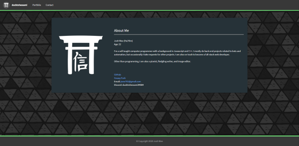
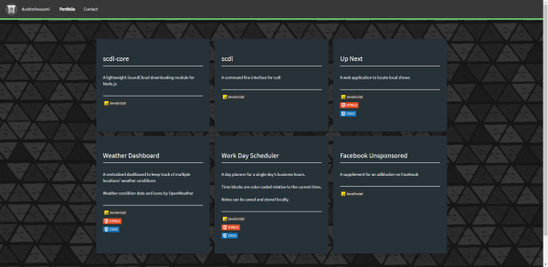
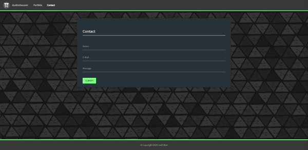

# ducktrshessami.github.io

A personal page containing my information and a portfolio of my programming projects

# Screenshots

Expand/Collapse

##### ~~But what is the point of putting screenshots for a portfolio?~~

Deployment: [ducktrshessami.github.io](https://ducktrshessami.github.io/)

Powered by [Materialize](https://materializecss.com/)
